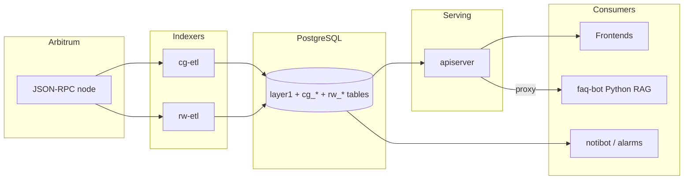

# Architecture

This document describes how the RWCG backend is put together: what runs, how
data flows, and where each concern lives in the repository.

## System overview

The backend indexes two families of smart contracts on Arbitrum —
**CosmicGame** (a round-based bidding game with prizes, raffles, staking and
charity mechanics) and **RandomWalk** (an NFT collection with a built-in
marketplace and community ranking) — into PostgreSQL, and serves that data
through a JSON API.

## Data flow

1. **Ingest.** `cg-etl` and `rw-etl` are thin configurations of the shared
   indexing engine (`internal/indexer`), which polls the chain head and
   fetches contract logs in adaptive batches via `eth_getLogs`. Each log's
   block and transaction are persisted (`block`, `transaction`, `evt_log`
   with the raw RLP), chain reorganizations are detected via block-hash
   checks and rolled back, then the event is dispatched through the typed
   handler registry (`internal/indexer/cosmicgame`, `.../randomwalk`): a pure
   decode step turns the log into a domain event, a store step writes it to
   its domain table (`cg_bid`, `cg_prize_claim`, `rw_mint_evt`, ...). Failed
   batches retry with exponential backoff (the
   process exits only after repeated consecutive failures), and the
   processing watermark only advances past fully processed blocks.
   PostgreSQL triggers maintain aggregate tables (`cg_bidder`,
   `cg_glob_stats`, ...) so reads stay cheap.
2. **Serve.** `apiserver` exposes the domain tables through two API
   generations: the OpenAPI-first v2 API ([openapi-v2.yaml](openapi-v2.yaml))
   is the canonical surface — its endpoint inventory is complete and every v1
   read/write behavior has a bounded replacement (mapped in
   [api-v2-migration.md](api-v2-migration.md)) — while the frozen v1 API
   ([openapi.yaml](openapi.yaml)) is deprecated: every v1 response carries an
   RFC 9745 `Deprecation` header and a migration-guide `Link` (plus an RFC
   8594 `Sunset` header once `V1_SUNSET_AT` announces the removal date), and
   v1 keeps answering byte-identically until the ADR-0005 sunset gates are
   met. V2 handlers implement generated strict stdlib interfaces on an
   injected `internal/api/v2.Server`; both versions share the same middleware
   and pgx store. The server also exposes ERC-721 `tokenURI` metadata at
   `/metadata/:token_id` (host-dispatched between the two collections, and
   permanently outside the versioned API because the deployed contracts pin
   the path) and the NFT image/video asset mirror at `/images/*`.
3. **Notify.** `notibot` polls for new events and posts to Discord/Twitter;
   `rwalk-alarm` and `srvmonitor` watch service health and alert via WhatsApp
   and a terminal dashboard.

## Repository layout

| Path | Contents |
|------|----------|
| `cmd/apiserver` | JSON API server (net/http ServeMux via `internal/api/httpx`): routing, TLS, static assets, health, metrics |
| `cmd/cg-etl`, `cmd/rw-etl` | Chain indexers, one per contract family |
| `cmd/notibot` | Discord/Twitter mint & trade notifications (thin wiring of `internal/notify/rwbot`, shared with `rwctl notify-bot`) |
| `cmd/freezer-scan`, `cmd/freezer-verify` | Geth freezer-file reader for historical backfill (scan pipeline in `internal/freezer/scan`, DB comparison in `internal/freezer/verify`) |
| `cmd/imggen-monitor` | Verifies/regenerates NFT image+video artifacts (engine in `internal/ops/imggen`) |
| `cmd/srvmonitor`, `cmd/loganomaly`, `cmd/rwalk-alarm` | Ops monitoring daemons (engines in `internal/srvmonitor` and `internal/notify/urlalarm`) |
| `cmd/cgctl`, `cmd/rwctl`, `cmd/opsctl` | Thin operator CLI wiring (contract interaction, social tools, data ops) |
| `internal/api` | HTTP stack: frozen v1 handlers, generated/injected `v2`, `httpx` router, `faq` proxy, shared middleware |
| `internal/store` | pgx-native database layer: pool-owning `Store` + `cosmicgame`/`randomwalk` repos (ADR-0002) |
| `internal/indexer` | Shared indexing engine: polling loop, batch/retry policy, block ops, chain-split handling, backfill, ETL metrics; typed event-handler registry plus reusable adaptive `logscan` ranges |
| `internal/ops` | Context-aware engines behind `opsctl`: archive, assets, CST scan, DB verification, API smoke testing and transaction backups |
| `internal/model` | Domain types and API response structs (`cosmicgame`, `randomwalk`) |
| `internal/timefmt` | Human-readable calendar-duration rendering (frozen v1 formats) |
| `internal/freezer` | Geth freezer/ancient store readers |
| `internal/notify` | Twitter (`tweets`) and WhatsApp (`wanotif`) clients, the unified RandomWalk bot (`rwbot`) and the URL watchdog (`urlalarm`) |
| `internal/srvmonitor` | Terminal server-monitoring engine (monitors, alarm tracker, layout; termbox UI in `termboxui`) |
| `internal/testdb` | Disposable migrated Postgres for integration tests (testcontainers) |
| `contracts/` | abigen-generated Go bindings (`bindings.gen.go` per package, regenerated from committed `buildjson/` artifacts with the go.mod-pinned abigen — see `contracts/README.md`) |
| `db/migrations` | goose schema migrations — the source of truth for the schema |
| `deploy/` | Dockerfile, systemd units |
| `faq-bot/` | Separate Python/Next.js RAG stack, proxied by apiserver |
| `docs/` | This documentation, OpenAPI spec, ADRs |

## Key design decisions

The ongoing modernization roadmap (test-first rewrite to idiomatic Go, API v2)
is tracked in [MODERNIZATION.md](MODERNIZATION.md).

Recorded as ADRs in [docs/adr/](adr/):

- **ADR-0001** — single Go module, `cmd/` + `internal/` layout.
- **ADR-0002** — database layer strategy: pgx/v5 driver, goose migrations,
  hand-written pgx queries (the interim sqlc scaffolding was retired when
  Phase 1 completed).
- **ADR-0003** — JSON-only API: the server-rendered `/black/*` HTML explorer
  was removed; frontends consume the JSON API.
- **ADR-0004** — mutating endpoints require a shared-secret header and fail
  closed; all routes are rate limited per client IP.
- **ADR-0005** — OpenAPI-first API v2 with generated strict stdlib handlers,
  opaque cursor pagination, RFC 9457 errors, and traffic-gated v1 retirement.
- **ADR-0006** — coverage policy: canonical handwritten-production metrics,
  generated/test-only exclusions, ratcheted floors and the ≥95% changed-code
  commit gate.
- **ADR-0007** — HTTP edge: global gzip compression and weak-ETag
  conditional requests in the middleware chain, transport-level headers.
- **ADR-0008** — v2 write conventions: POSTs with typed 201 bodies,
  RFC 9457 problem details, spec-declared auth headers and per-operation
  rate limits.

## Databases and schemas

Everything lives in one PostgreSQL database (default schema `public`):

- **Layer-1 tables** (`block`, `address`, `transaction`, `evt_log`,
  `evt_topic`) store raw chain data with RLP payloads for replay/verification.
- **CosmicGame tables** (`cg_*`) hold decoded game events and trigger-managed
  aggregates.
- **RandomWalk tables** (`rw_*`) hold mints, marketplace activity, and the
  Elo-style ranking state.
- **Archive tables** (`arch_*`) mirror pruned historical data recovered from
  geth freezer files.

Schema changes are goose migrations in `db/migrations`; never edit the schema
manually. `make migrate-up` applies them; `internal/testdb` applies them to
throwaway containers in integration tests, so every migration is exercised by
CI.

## Observability

- `GET /healthz` — liveness; `GET /readyz` — readiness (DB ping).
- Prometheus metrics and pprof on the private `METRICS_ADDR` listener.
- Request metrics: `rwcg_http_requests_total` (labelled by route template,
  status class and `deprecated` — the v1-membership flag the sunset gate
  reads; see docs/operations.md) and `rwcg_http_request_duration_seconds`
  (labelled by route template).
