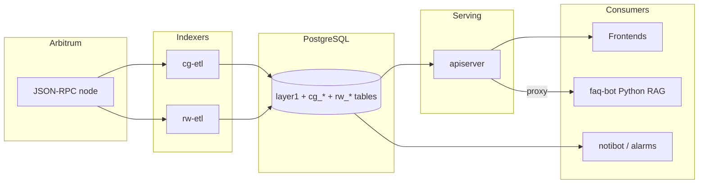

# Architecture

This document describes how the RWCG backend is put together: what runs, how
data flows, and where each concern lives in the repository.

## System overview

The backend indexes two families of smart contracts on Arbitrum —
**CosmicGame** (a round-based bidding game with prizes, raffles, staking and
charity mechanics) and **RandomWalk** (an NFT collection with a built-in
marketplace and community ranking) — into PostgreSQL, and serves that data
through a JSON API.

## Data flow

1. **Ingest.** `cg-etl` and `rw-etl` poll the chain head and fetch contract
   logs in adaptive batches via `eth_getLogs`. Each log's block and
   transaction are persisted (`block`, `transaction`, `evt_log` with the raw
   RLP), chain reorganizations are detected via parent-hash checks, then the
   event is decoded against the contract ABI and written to its domain table
   (`cg_bid`, `cg_prize_claim`, `rw_mint_evt`, ...). PostgreSQL triggers
   maintain aggregate tables (`cg_bidder`, `cg_glob_stats`, ...) so reads stay
   cheap.
2. **Serve.** `apiserver` exposes the domain tables as a JSON API (see
   [docs/openapi.yaml](openapi.yaml)), plus ERC-721 `tokenURI` metadata at
   `/metadata/:token_id` (host-dispatched between the two collections) and the
   NFT image/video asset mirror at `/images/*`.
3. **Notify.** `notibot` polls for new events and posts to Discord/Twitter;
   `rwalk-alarm` and `srvmonitor` watch service health and alert via WhatsApp
   and a terminal dashboard.

## Repository layout

| Path | Contents |
|------|----------|
| `cmd/apiserver` | JSON API server (gin): routing, TLS, static assets, health, metrics |
| `cmd/cg-etl`, `cmd/rw-etl` | Chain indexers, one per contract family |
| `cmd/notibot` | Discord/Twitter mint & trade notifications |
| `cmd/freezer-scan`, `cmd/freezer-verify` | Geth freezer-file reader for historical backfill |
| `cmd/imggen-monitor` | Verifies/regenerates NFT image+video artifacts |
| `cmd/srvmonitor`, `cmd/loganomaly`, `cmd/rwalk-alarm` | Ops monitoring daemons |
| `cmd/cgctl`, `cmd/rwctl`, `cmd/opsctl` | Operator CLIs (contract interaction, social tools, data ops) |
| `internal/api` | HTTP handlers: `cosmicgame`, `randomwalk`, `faq` proxy, `common` middleware |
| `internal/store` | Database layer (being migrated to pgx/sqlc — see ADR-0002) |
| `internal/store/queries` + `internal/store/sqlcgen` | sqlc source queries and generated code |
| `internal/etl` | Shared ETL machinery: event fetching, block ops, chain-split handling |
| `internal/primitives` | Domain types and API response structs |
| `internal/freezer` | Geth freezer/ancient store readers |
| `internal/notify` | Twitter (`tweets`) and WhatsApp (`wanotif`) clients |
| `internal/testdb` | Disposable migrated Postgres for integration tests (testcontainers) |
| `contracts/` | abigen-generated Go bindings (do not edit by hand) |
| `db/migrations` | goose schema migrations — the source of truth for the schema |
| `deploy/` | Dockerfile, systemd units |
| `faq-bot/` | Separate Python/Next.js RAG stack, proxied by apiserver |
| `docs/` | This documentation, OpenAPI spec, ADRs |

## Key design decisions

The ongoing modernization roadmap (test-first rewrite to idiomatic Go, API v2)
is tracked in [MODERNIZATION.md](MODERNIZATION.md).

Recorded as ADRs in [docs/adr/](adr/):

- **ADR-0001** — single Go module, `cmd/` + `internal/` layout.
- **ADR-0002** — database layer strategy: pgx/v5 driver, goose migrations,
  incremental sqlc adoption for queries.
- **ADR-0003** — JSON-only API: the server-rendered `/black/*` HTML explorer
  was removed; frontends consume the JSON API.
- **ADR-0004** — mutating endpoints require a shared-secret header and fail
  closed; all routes are rate limited per client IP.

## Databases and schemas

Everything lives in one PostgreSQL database (default schema `public`):

- **Layer-1 tables** (`block`, `address`, `transaction`, `evt_log`,
  `evt_topic`) store raw chain data with RLP payloads for replay/verification.
- **CosmicGame tables** (`cg_*`) hold decoded game events and trigger-managed
  aggregates.
- **RandomWalk tables** (`rw_*`) hold mints, marketplace activity, and the
  Elo-style ranking state.
- **Archive tables** (`arch_*`) mirror pruned historical data recovered from
  geth freezer files.

Schema changes are goose migrations in `db/migrations`; never edit the schema
manually. `make migrate-up` applies them; `internal/testdb` applies them to
throwaway containers in integration tests, so every migration is exercised by
CI.

## Observability

- `GET /healthz` — liveness; `GET /readyz` — readiness (DB ping).
- Prometheus metrics and pprof on the private `METRICS_ADDR` listener.
- Request metrics: `rwcg_http_requests_total`,
  `rwcg_http_request_duration_seconds` (labelled by route template).
