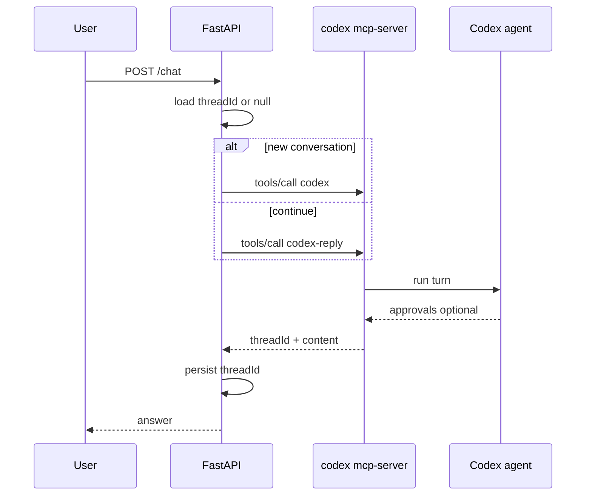

## Summary

`codex mcp-server` runs Codex as a **stdio MCP server** (JSON-RPC 2.0, newline-delimited). It exposes **two MCP tools** that wrap the full Codex agent. Your machine has **codex-cli 0.120.0**; `~/.codex/config.toml` exists but has **no `[mcp_servers.*]`** entries yet. A recent MCP session against `/home/niko/eth/dev/faq-bot` used `source: "mcp"` with `read-only` sandbox.

---

## 1. Available MCP tools

A `tools/list` on `codex mcp-server` returns exactly **two tools** (confirmed by CLI help, [Agents SDK guide](https://developers.openai.com/codex/guides/agents-sdk), and `codex-rs/mcp-server/src/codex_tool_config.rs`).

### `codex` — start a new session

| Property | Type | Required | Description |
|----------|------|----------|-------------|
| `prompt` | string | yes | Initial user message |
| `approval-policy` | enum | no | `untrusted`, `on-failure`, `on-request`, `never` |
| `sandbox` | enum | no | `read-only`, `workspace-write`, `danger-full-access` |
| `model` | string | no | e.g. `gpt-5.4` |
| `profile` | string | no | Config profile from `config.toml` |
| `cwd` | string | no | Working directory (relative → server CWD) |
| `config` | object | no | Overrides for `~/.codex/config.toml` keys |
| `base-instructions` | string | no | Replace default system instructions |
| `developer-instructions` | string | no | Extra developer-role instructions |
| `compact-prompt` | string | no | Prompt used when compacting history |

Docs also mention `include-plan-tool` (boolean) in the [Agents SDK guide](https://developers.openai.com/codex/guides/agents-sdk); the Rust schema in current `codex_tool_config.rs` may lag that doc slightly.

**Output** (`structuredContent` + legacy `content`):

```json
{
  "threadId": "019bbed6-1e9e-7f31-984c-a05b65045719",
  "content": "Final assistant text"
}
```

### `codex-reply` — continue a session

| Property | Type | Required | Description |
|----------|------|----------|-------------|
| `prompt` | string | yes | Next user message |
| `threadId` | string | yes* | From prior `codex` / `codex-reply` response |
| `conversationId` | string | no | Deprecated alias for `threadId` |

\*Schema marks `threadId` optional for backward compat, but runtime requires `threadId` or `conversationId`.

Same output shape as `codex`.

### Server → client requests (not tools you call)

While a turn runs, the server may send **elicitation/approval** requests to the MCP **client**:

- `elicitation/create` for **exec approval** (shell commands)
- Patch approval flows (file edits)

Your client must respond (e.g. `decision: allow/deny`) or Codex stalls. Use `"approval-policy": "never"` and `"sandbox": "read-only"` for unattended FAQ-style Q&A.

### Lower-level app-server API (related, not MCP tools)

[`codex_mcp_interface.md`](https://github.com/openai/codex/blob/main/codex-rs/docs/codex_mcp_interface.md) documents an **experimental** JSON-RPC surface (`thread/start`, `turn/start`, `model/list`, etc.) used by `codex app-server`. That is the engine behind the IDE/extension; **`codex mcp-server` does not expose those as MCP tools**—only `codex` and `codex-reply`. For fine-grained control, use `codex app-server` (stdio JSONL) instead of MCP.

---

## 2. Connection method

| Aspect | Detail |
|--------|--------|
| **Transport** | **stdio only** — CLI: `Start Codex as an MCP server (stdio)` |
| **Protocol** | MCP over JSON-RPC 2.0, **one JSON object per line** on stdin/stdout |
| **HTTP/SSE** | **Not supported** for `codex mcp-server` |
| **Launch** | `codex mcp-server` or `npx -y codex mcp-server` |
| **Inspect** | `npx @modelcontextprotocol/inspector codex mcp-server` |
| **Config** | Loads `~/.codex/config.toml` (+ `-c key=value` overrides); uses `~/.codex/auth.json` for auth |
| **Separate command** | `codex mcp` manages **external** MCP servers Codex consumes—not this server |

**Direction clarification:**

- **`codex mcp-server`** → Codex **is** the MCP server (for your FastAPI/agents to call).
- **`codex mcp add …`** → Codex **is** the MCP client (Context7, Figma, etc. in [MCP docs](https://developers.openai.com/codex/mcp)).

Configured external servers in `config.toml` are available **inside** Codex sessions started via `codex` / `codex-reply`, not as extra tools on the Codex MCP server itself.

---

## 3. Documentation map

| Resource | URL |
|----------|-----|
| MCP interface (experimental) | https://github.com/openai/codex/blob/main/codex-rs/docs/codex_mcp_interface.md |
| Agents SDK + Codex MCP | https://developers.openai.com/codex/guides/agents-sdk |
| Cookbook (multi-agent) | https://developers.openai.com/cookbook/examples/codex/codex_mcp_agents_sdk/building_consistent_workflows_codex_cli_agents_sdk |
| MCP config (client side) | https://developers.openai.com/codex/mcp |
| App server (low-level) | https://developers.openai.com/codex/app-server |
| Non-interactive alternative | https://developers.openai.com/codex/noninteractive |
| Tool schemas (source) | https://github.com/openai/codex/blob/main/codex-rs/mcp-server/src/codex_tool_config.rs |

---

## 4. Recommended pattern: Python FastAPI + Codex MCP

### Architecture options

**A. Thin MCP client (best if you want direct control)**

```text
FastAPI → asyncio MCP client → subprocess `codex mcp-server` (stdio)
         → tools/call `codex` / `codex-reply`
         → store threadId per user/session in your DB
```

Use the official Python MCP SDK (`mcp` package) with `StdioServerParameters(command="codex", args=["mcp-server"])`.

**B. OpenAI Agents SDK (best if an orchestrator LLM should decide when to invoke Codex)**

```python
from agents import Agent, Runner
from agents.mcp import MCPServerStdio

async with MCPServerStdio(
    name="Codex CLI",
    params={"command": "codex", "args": ["mcp-server"]},  # or npx -y codex mcp-server
    client_session_timeout_seconds=360000,  # Codex turns can take minutes
) as codex_mcp:
    faq_agent = Agent(
        name="FAQ Bot",
        instructions="Answer from the FAQ corpus only. Call codex only when you need repo/files.",
        mcp_servers=[codex_mcp],
    )
    result = await Runner.run(faq_agent, user_message)
```

FastAPI holds a **process-wide** `MCPServerStdio` context (started on lifespan startup) and routes each HTTP request through `Runner.run` with session-scoped `threadId` in instructions or a small state store.

**C. `codex exec` subprocess (often better for FAQ-only)**

For “answer from docs, no coding agent,” **`codex exec`** is simpler than MCP:

```bash
codex exec --sandbox read-only --ephemeral "Answer using only: <faq context>. Question: ..."
```

Pipe FAQ context on stdin or embed in prompt; parse stdout or `--json` JSONL. No MCP client, no approval elicitation loop—still uses Codex auth and models.

### Suggested FastAPI flow (MCP)



**Operational settings for FAQ bot:**

```json
{
  "prompt": "<user question + injected FAQ corpus>",
  "cwd": "/path/to/faq-bot",
  "sandbox": "read-only",
  "approval-policy": "never",
  "base-instructions": "Answer only from the provided FAQ. Do not run shell commands."
}
```

**Auth:** Ensure the Codex process inherits credentials from `codex login` (`~/.codex/auth.json`) or set `CODEX_API_KEY` for API-key flows where supported.

---

## 5. Limitations and risks

| Limitation | Impact on FAQ bot |
|------------|-------------------|
| **stdio only** | One Codex process per MCP connection; scale with a pool or queue, not HTTP load-balancing to `mcp-server` |
| **Long-running turns** | Minutes per call; set MCP client timeouts very high (cookbook uses 360000s) |
| **Coding agent, not chat API** | Shell/file/MCP tools, planning, high token use—heavy for simple FAQ unless constrained |
| **Approval elicitation** | Without `approval-policy: never`, server blocks on `elicitation/create` until client responds |
| **Experimental API** | Tool shapes and `codex_mcp_interface.md` can change without notice |
| **Auth on host** | Server runs as local user with Codex credentials; not multi-tenant safe without isolation |
| **Thread storage** | Sessions persist under `~/.codex/sessions/` unless ephemeral patterns used |
| **Git repo check** | `codex exec` requires a git repo by default; MCP sessions in your faq-bot repo satisfy this for that cwd |
| **No per-request MCP config** | External MCP servers come from `config.toml`, not per HTTP request ([issue #9550](https://github.com/openai/codex/issues/9550)) |
| **Rate limits** | Codex/ChatGPT plan limits apply (your sessions show `plan_type: team`) |
| **Concurrent users** | Single stdio server ≈ one active Codex turn at a time unless you run multiple subprocesses |
| **Websocket app-server** | `codex app-server --listen ws://` is experimental/unsupported—not a substitute for `mcp-server` |

---

## 6. Your system state

| Item | Finding |
|------|---------|
| Codex CLI | `codex-cli 0.120.0` at `/usr/local/node/bin/codex` |
| Config | `/home/niko/.codex/config.toml` — model `gpt-5.4`, no `[mcp_servers]` |
| MCP session evidence | `/home/niko/.codex/sessions/2026/05/20/...jsonl` — `originator: codex_cli_rs`, `source: mcp`, cwd `faq-bot`, `read-only` sandbox |
| FAQ bot repo | `/home/niko/eth/dev/faq-bot` — no Codex/MCP integration code found yet |

---

## Practical recommendation for an FAQ bot

1. **If the bot only answers from a static FAQ corpus:** prefer **OpenAI Responses/Chat Completions + RAG**, or **`codex exec --sandbox read-only`** with FAQ text in the prompt—not full MCP unless you need Codex’s repo tools.
2. **If the bot must read/update the repo, call configured MCP servers (e.g. docs), or reuse Codex skills:** use **`codex mcp-server`** with a long-lived stdio connection, `threadId` per chat session, and `approval-policy: never` + `read-only` sandbox.
3. **If you want a meta-agent to route tasks:** use **Agents SDK + `MCPServerStdio`** as in the [cookbook](https://developers.openai.com/cookbook/examples/codex/codex_mcp_agents_sdk/building_consistent_workflows_codex_cli_agents_sdk).

I can next outline a minimal FastAPI + MCP client module structure (still Ask mode—guidance only) or compare `codex exec` vs MCP for your exact faq-bot layout if you share whether answers are file-backed only or need live repo access.
